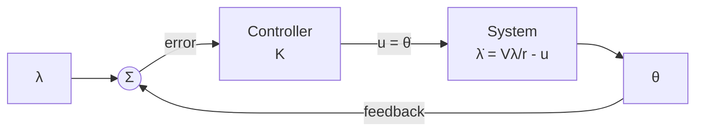

# missile-guidance-sim
Kinematic missile guidance simulation comparing Pole Placement, LQR, and Proportional Navigation. Tracks performance and accumulated steering effort for each method for comparison.

## How to run
**Dependencies**
```python
pygame
matplotlib.pyplot
numpy
sciplot.signal place_poles
scipy.linalg solve_contininus_are
```

```console
git clone https://github.com/jespernytun/missile-guidence-sim
python3 -m venv venv
pip install numpy
pip install scipy
pip install pygame
pip install matplotlib
source bin/activate
./missile.py
```

**Parameters**
User is free to play around with tau, N and (Q,R) \
-  tau represents the response time for the proportional controller
-  N is the gain for the proportional navigator
-  (Q,R) represent the cost function for the LQR controller

## About the code
This project is a 2D missile guidence simulator, made to make me understand the limits a proportional controller, and an introduction to the LQR and Proportional Navigation controllers. 

The simulation displayed using pygame, and plots the real time position of the different missiles and the target, with a HUD with useful telemetry for eachh of the 3 missiles. The target is self is random — it spawns somwhere between ((200,600)(200,600)), with an undetermined speed and angle. 

After the simulation is finished, two plots will appear to compare the performance of the missiles. The first plot is the total accumulated effort. It is calculaed by adding up all the changes to theta. This variable is something you'd like to minimize, to optimalize performance.
```python
effort.append(effort[-1] + abs(u*dt))
```
The second graph is the momentary steering for each of the three rockets. A peak would correspond to an immense momentary effort to change course.
```python
steering.append(u*dt)
```

## What I have learned
**Controlability**
In my coursework, all exercices start by asking us to calculate the controlability and observabiliy matrixes. In this project, after having calculated my state space representation, I skipped this part. What I didn't realize, even though in hindsight it makes intuetivly sense, is that I have no way of controlling my position directly. The error was noticed when I started coding, and the scipy.signal.place_poles function didn't work. After a long time debugging I found out I'd calculate my controlabillity matrix, where I realized my error.

Therefore I had to drop down to a first order system, which made the P(ID) vs LQR comparaison less interesting. A later improvement to this project will be to make a full 6 order to make a more interestiing coparaison between the different controllers. This will be done in the future when I get a formal introduction to the LQR later in my cousework.

Key takeaway: Listen to your professor, do the test to see if your system is actually controllable before starting.

**Choice of controller**
My project make me realize that for my first order system that the P(ID) and the LQR system is in a physical sense the exact same approach, just two different methods to calculate the feedback gain K. The method with pole placements let's me define the performance directly, whereas the LQR let's me find an optimal solution using a cost function. For a first order system like this, the pole placement method remains very simple to implement, whereas for a higher order system, this method might become harder to implement. An LQR will prove itself more useful for a v2 of this project taking forces into consideration. 


